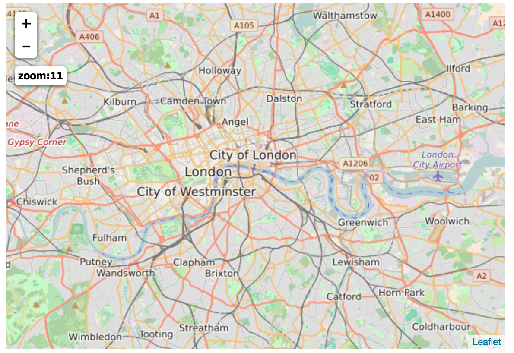

Leaflet.zoomdisplay
===================

Forked from [here] (http://azavea.github.com/Leaflet.zoomdisplay/).

I made it compatible with npm and react-leaflet.

## Usage

  1. Add a `<link>` tag to your page referencing the stylesheet 
  2. Require from npm: const {ZoomDisplay} = require("react-leaflet-zoom-display");
  
See **example** folder 

  

